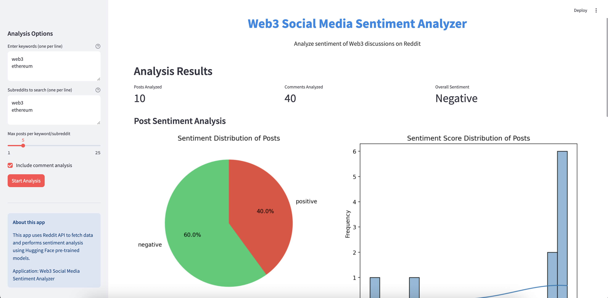

# Web3 Social Media Sentiment Analyzer

A powerful web application that analyzes sentiment in Web3-related discussions on Reddit. Track how blockchain communities feel about specific topics, cryptocurrencies, NFTs, and emerging technologies.

## 🚀 Features

- **Keyword-Based Analysis**: Enter multiple Web3-related keywords to analyze sentiment patterns
- **Multi-Subreddit Support**: Analyze data from various cryptocurrency and blockchain communities
- **Content Filtering**: Focus on posts, comments, or both for comprehensive analysis
- **Advanced Sentiment Analysis**: Uses Hugging Face transformers to accurately detect positive, negative, or neutral sentiment
- **Real-time Data**: Fetches the latest discussions from Reddit
- **Interactive Visualizations**:
  - Sentiment distribution pie charts
  - Sentiment score histograms
  - Subreddit comparison charts
- **Detailed Metrics**: Posts analyzed, comments analyzed, and overall sentiment trend
- **In-depth Data Tables**: Browse analyzed content with links to original Reddit posts
- **User-Friendly Interface**: Clean, responsive design built with Streamlit
- **API Integration**: Seamlessly connects with Reddit's API for data retrieval

## 📊 Screenshots



## 🛠️ Installation

### Prerequisites

- Python 3.7 or higher
- Reddit API credentials (Client ID and Client Secret)

### Setup Instructions

1. **Clone the repository**:
   ```bash
   git clone https://github.com/yourusername/web3-sentiment-analyzer.git
   cd web3-sentiment-analyzer
   ```

2. **Create and activate a virtual environment**:
   ```bash
   python -m venv venv
   source venv/bin/activate  # On Windows: venv\Scripts\activate
   ```

3. **Install dependencies**:
   ```bash
   pip install -r requirements.txt
   ```

4. **Configure Reddit API credentials**:
   Create a `.env` file in the project root with:
   ```
   REDDIT_CLIENT_ID="your_client_id"
   REDDIT_CLIENT_SECRET="your_client_secret"
   ```

## 🚀 Running the Application

Run the application using the provided script:

```bash
python run_app.py
```

Alternatively, you can run directly with Streamlit:

```bash
streamlit run src/app.py
```

The web interface will open automatically in your default browser.

## 💡 Usage Guide

1. **Configure Analysis Parameters**:
   - Enter keywords related to Web3 topics (one per line)
   - Select subreddits to analyze
   - Set the maximum number of posts to retrieve per keyword/subreddit
   - Choose whether to include comment analysis

2. **Run the Analysis**:
   - Click "Start Analysis" to begin data collection and sentiment processing
   - The progress bar will show the current status of the analysis

3. **Explore Results**:
   - Review the overall sentiment metrics
   - Analyze the sentiment distribution charts
   - Compare sentiment across different subreddits
   - Examine detailed post and comment data in expandable sections

## 🧠 How It Works

1. **Data Collection**: The application connects to Reddit via PRAW (Python Reddit API Wrapper) and retrieves posts containing the specified keywords from selected subreddits
   
2. **Sentiment Analysis**: Using Hugging Face's transformers library, the application analyzes the sentiment of each post and comment, assigning them a sentiment category (positive, negative, or neutral) and a confidence score

3. **Visualization**: The processed data is visualized using Matplotlib, Seaborn, and Streamlit's native charting capabilities

4. **Interactive Results**: Users can interact with the data through Streamlit's interface, drilling down into specific aspects of the analysis

## 🔧 Technical Architecture

The project is structured as follows:

- `src/app.py`: Main Streamlit application and UI
- `src/reddit_api.py`: Reddit data fetching module
- `src/sentiment.py`: Sentiment analysis module
- `run_app.py`: Entry point script for running the application
- `requirements.txt`: Project dependencies

## 📋 Requirements

Key dependencies include:

- streamlit: Web application framework
- praw: Reddit API client
- transformers: State-of-the-art NLP models
- pandas: Data manipulation and analysis
- matplotlib & seaborn: Data visualization
- python-dotenv: Environment variable management

For a complete list, see [requirements.txt](requirements.txt).

## 🔍 Future Improvements

- Time-series analysis of sentiment trends
- Additional social media platform integrations
- Advanced filtering options
- Report generation capabilities
- Custom model training for Web3-specific sentiment analysis

## 📄 License

This project is licensed under the MIT License - see the LICENSE file for details.

## 🤝 Contributing

Contributions are welcome! Please feel free to submit a Pull Request.

1. Fork the repository
2. Create your feature branch (`git checkout -b feature/amazing-feature`)
3. Commit your changes (`git commit -m 'Add some amazing feature'`)
4. Push to the branch (`git push origin feature/amazing-feature`)
5. Open a Pull Request

---

*Note: This project is for educational and research purposes only. Always respect Reddit's API terms of service and rate limits when using this application.*